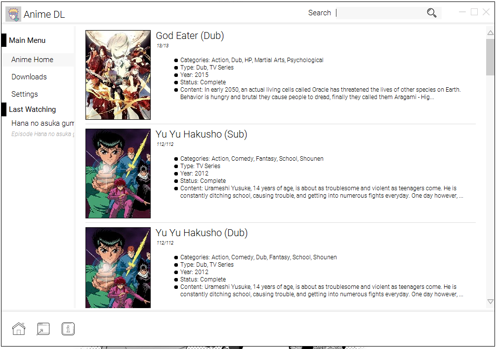
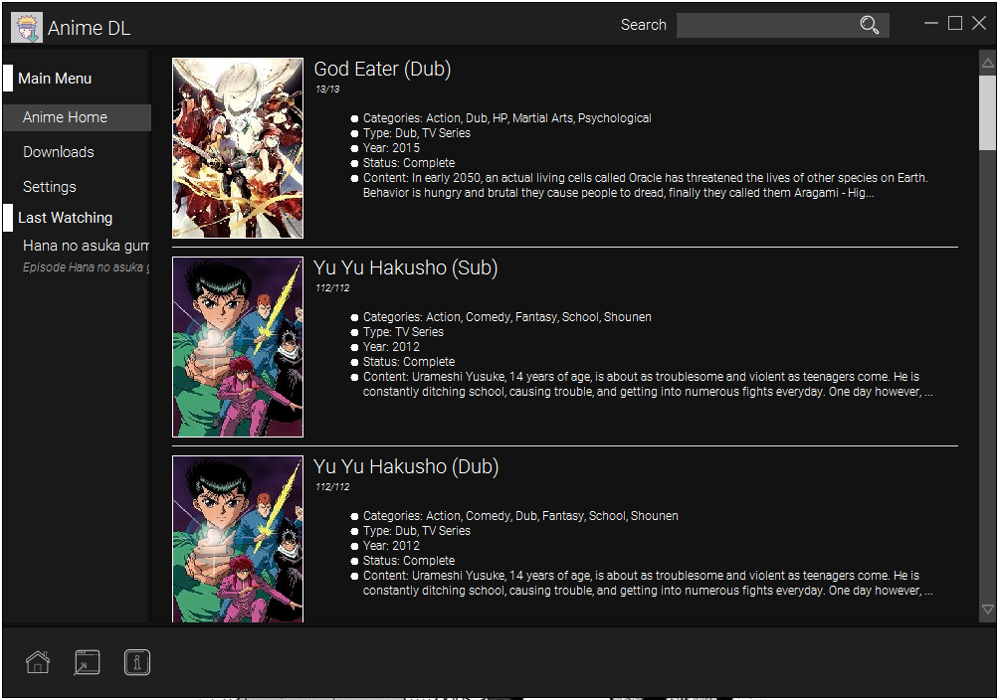

 
# Anime DL

###Latest Version: v7.0
####Modern GUI

A simple app let you watch and bulk download anime with faster anime Browsing, Streaming and Downloading.
Steaming and Downloading animes becomes easy.

####Light and Dark Theme Support

##Light Theme

##Dark Theme

## New Version Feature and Changes in v7.0
* Fully updated GUI.
* Added Light and Dark Theme support.
* New icon designs
* Added new Source as "Source 5" with highspeed links.(Almost all episode with 1080p low size)
* Mouse Over shows Hint about button. You can also disable this in settings.
* Next or Previous Episode play option added in Player.(Once you start epiosde of any anime it loads the all epiosde to player playlist. After that you can do other things in app).

## Feature
* Both Linux and Windows supported
* Auto check for update
* No installation require works with java
* Multiple sources to download from. More sources on the way.
* Stream or Download all or multiple episode with single clicks from a single window.
* Easy to use and navigate
* Integrated download manager ported from popular "XDM" download manager.
* You can choose from two download managers 1. Integrated or 2. Idman if you have installed
* Queue support. you change can how many files to download parallelly.
* VLC libs support used for streaming
* Added Keyboard keylistner to searchbar and VLC.
* New Source added in place of source 3, Best highspeed 1080p videos stream and download.
* Faster anime searching and loading.
* Improvement to GUI interface.
* Added new source - 1080p links of size ~150 to ~200mb
* Bug fixed - images not displaying on correct anime name under source 0.
* Added Functionality(Video Player) - "Esc" button to exit fullscreen.
* Added Functionality(App) - last watched anime option added to panel for information and same can be used to continue watching the episode.
* Added Functionality(App) - Option to select number of episodes to download in Anime Panel.
* Improvement to error handling.
* Source 2 fixed for streaming and downlaoding. Now having both subbed and dubbed anime with highspeed links.
* Source 2 updated with options to select the quality: Auto promotion of other quality if select not available.
* Source 4 updated with new server: Having low size files to download.
* Added section in settings to show some info about sources.
* Added Announcement section added for providing info to user incase require.
* FFMPEG libs interation for downloading hls files.
* Option for selecting to delete anime episode file stored in disk storage.
* Changed start of last watching anime from anime name to epiosde.
* GUI changes in Anime DL panel.
* and many more

## Note:-
* If you have any suggestion or new feature idea feel free to contact me.
* I want make this app to reach as many as people as possible please help me with that as i don't know any other platform to share this app.
* For any issue feel free to email me.(Email in about of application)
* Due to some issue with VLC libs Streaming nto working from source 1, However downloading working fine.

Download Link:- Please see the released section. 
Alternative Download Links:- http://a.animedlweb.ga/

PC version Link:- http://a.animedlweb.ga/

Discord Server Link:- https://discord.gg/Ee3fegN

## Requirements:
    -Internet
    -Java 8 or higher installed.
    -VLC Player Libs(For Streaming)
	 Set the VLCLibs path in setting to installed VLC player
	 or
	 Download the [VLCLibs.zip] from below link and place the VLCLibs folder in same location as jar file.
		https://archive.org/details/VLCLibs
		Note: For 32 bit java please select 32 bit VLC libs and for 64 bit java please select VLC libs.
	-FFMPEG Libs for downloading
	Set the ffmpeg libs path in setting to location where the ffmpeg.exe file is present
	 or
	 Download the [ffmpeg.zip] from below link and place the ffmpeg folder in same location as jar file or select the location where the files has been extracted.
		https://archive.org/details/ffmpeg_202006
    -For IDMan to work - add path of idman folder to window 'PATH' See below steps:
 	 "C:\Program Files (x86)\Internet Download Manager"
  	 or
  	"Your Internet download manager installation path"
	
 	 Steps as Below:
  	--Go to Computers--Properties--Advanced System Settings--Environment Variables--
 	 in system Variables
 	 double click "Path" and add your IDMAN installation path to Variables Value Editbox
  	Press Enter.
	
Start the application from bat file for windows users if jar file not starts.
